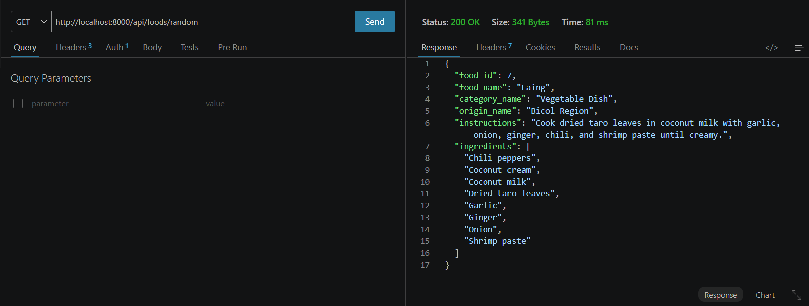
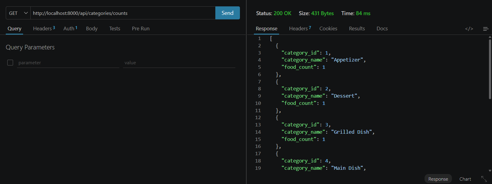
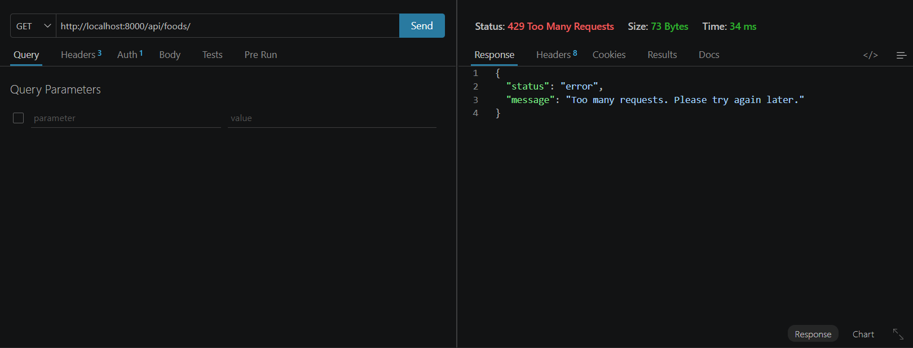

# API Documentation

## 1. API Title

**Filipino Cookbook API** (Secured REST API)

---

## 2. API Description

The Filipino Cookbook API is a secured RESTful web service that provides structured information about Filipino dishes. It exposes foods with their categories, regional origins, cooking instructions, and related ingredients.

**Purpose:** Allow client applications (web, mobile, or desktop) to browse, search, filter, create, update, and delete Filipino cookbook data through JSON endpoints protected by Bearer-token authentication.

**Type of information provided:** Dish names, categories (e.g. Soup, Main Dish), origins (e.g. Bicol Region, Philippines), cooking instructions, and ingredient lists linked through a many-to-many relationship.

**Intended users:** Students and developers building API clients for coursework or demos; anyone integrating Filipino cookbook data into an application.

**Main functions:** List and retrieve foods; search by name; filter by category, origin, or ingredient; get a random food; list categories (with optional food counts) and ingredients; create/update/delete foods with validated payloads.

**Technologies used:** PHP, Slim Framework 4, MySQL (PDO), Composer, Apache/XAMPP (typical local host), Thunder Client / Postman for testing, Git / GitHub for version control.

---

## 3. Features

- Public welcome endpoint (`GET /`) with no token required
- Bearer-token protection on all `/api` routes
- List all foods with nested ingredients
- Get a single food by ID
- Get a randomly selected food
- Search foods by name (`LIKE` match)
- Filter foods by category name
- Filter foods by origin name
- List all categories and all ingredients
- Get food counts per category (`COUNT` / `GROUP BY`)
- List foods that use a given ingredient ID
- Create, update, and delete foods
- Input validation and sanitization on write endpoints and path parameters (`food_name`, `instructions`, FK checks for category/origin/ingredients; positive integer ID checks)
- Per-IP rate limiting (default 120 requests / 60 seconds; configurable; returns `429`)
- Secure error handling (generic `500` responses; debug details only when `APP_DEBUG` is enabled)
- Configuration via `config.php` / environment variables (see `config.example.php`)

---

## 4. Technologies Used

| Area | Technology |
|------|------------|
| Language | PHP |
| Framework | Slim Framework 4 (`slim/slim`, `slim/psr7`) |
| Database | MySQL (`filipino_cookbook_api`) via PDO |
| Dependency manager | Composer |
| Typical local server | Apache (XAMPP) / PHP built-in or vhost serving `public/` |
| API testing | Thunder Client, Postman |
| Version control | Git, GitHub |

---

## 5. Installation Instructions

1. Clone the repository and open the project folder.
2. Install PHP dependencies from the project root:

```bash
composer install
```

3. Copy the example config and edit real values locally:

```bash
copy config.example.php config.php
```

*(On macOS/Linux: `cp config.example.php config.php`.)*

4. In `config.php`, set MySQL host, database name, username, password, charset, and `API_TOKEN`.  
   You may instead set environment variables: `DB_HOST`, `DB_NAME`, `DB_USER`, `DB_PASS`, `DB_CHARSET`, `API_TOKEN`, `RATE_LIMIT_MAX`, `RATE_LIMIT_WINDOW`.  
   Do **not** commit `config.php` (it is in `.gitignore`). Only `config.example.php` with placeholders belongs in the repo.
5. Import the SQL database (see **Database Setup** below).
6. Serve the project so `public/` is reachable (e.g. place/copy the project under XAMPP `htdocs` and start Apache + MySQL).
7. Test:
   - Open `GET {{baseUrl}}/` in a browser or Thunder Client (no token).
   - Call `GET {{baseUrl}}/api/foods` with header `Authorization: Bearer YOUR_API_TOKEN_HERE` (value from your `config.php`).

---

## 6. Database Setup

- **Database name:** `filipino_cookbook_api`
- **SQL file:** `database/filipino_foods_relational.sql`

**Tables:**

| Table | Role |
|-------|------|
| `categories` | Food categories (`category_id`, `category_name`) |
| `origins` | Regional origins (`origin_id`, `origin_name`) |
| `foods` | Dishes (`food_id`, `food_name`, `category_id`, `origin_id`, `instructions`) |
| `ingredients` | Ingredient names (`ingredient_id`, `ingredient_name`) |
| `food_ingredients` | Many-to-many link between foods and ingredients |

**Table relationships:** `categories` → `foods` ← `origins`, and `foods` → `food_ingredients` ← `ingredients` (many-to-many).

### Import with phpMyAdmin

1. Open phpMyAdmin (usually `http://localhost/phpmyadmin`).
2. Create a database named exactly `filipino_cookbook_api` (utf8mb4 collation is fine).
3. Select that database → **Import**.
4. Choose `database/filipino_foods_relational.sql`.
5. Click **Go** / **Import** and confirm tables and sample data were created.

> The SQL script also includes `CREATE DATABASE` / `USE filipino_cookbook_api`. Import still works if you already created the database.

### Import with MySQL CLI

```bash
mysql -u root -p < database/filipino_foods_relational.sql
```

Or:

```bash
mysql -u root -p -e "CREATE DATABASE IF NOT EXISTS filipino_cookbook_api;"
mysql -u root -p filipino_cookbook_api < database/filipino_foods_relational.sql
```

---

## 7. Base URL

Local XAMPP example (adjust the folder name if your project path differs):

```text
http://localhost/filipino-cookbook-api/public
```

| Purpose | Full URL |
|---------|----------|
| Welcome (no token) | `http://localhost/filipino-cookbook-api/public/` |
| List foods (token required) | `http://localhost/filipino-cookbook-api/public/api/foods` |
| Search foods | `http://localhost/filipino-cookbook-api/public/api/foods/search/Ado` |

In Thunder Client / Postman, store this as `{{baseUrl}}` and call paths like `{{baseUrl}}/api/foods`.

---

## 8. Authentication Instructions

- **Method:** Bearer token (static API token compared in middleware `requireToken`).
- **Token location:** Defined as `API_TOKEN` in local `config.php`, or via the `API_TOKEN` environment variable (see `config.example.php`).
- **Header format:**

```http
Authorization: Bearer YOUR_API_TOKEN_HERE
```

- All routes under `/api/...` require a valid token.
- `GET /` does **not** require a token.
- Missing header, non-Bearer format, or wrong token → **401**:

```json
{
  "status": "error",
  "message": "Unauthorized access. Valid API token is required."
}
```

Do not publish real tokens in documentation or commits.

**Token expiration:** Not applicable. This API uses a static shared Bearer token (`API_TOKEN`), not JWT or session tokens with claims/TTL. Expiration would require introducing a new authentication system and is intentionally not implemented.

**Rate limiting:** All routes (including `/`) are subject to per-IP rate limiting. Defaults are 120 requests per 60 seconds (`RATE_LIMIT_MAX` / `RATE_LIMIT_WINDOW` in `config.example.php` or environment variables). Set `RATE_LIMIT_MAX=0` to disable. Exceeding the limit returns **429** with a `Retry-After` header.

---

## 9. Endpoint Documentation

Unless noted, `/api` endpoints require:

```http
Authorization: Bearer YOUR_API_TOKEN_HERE
```

Food objects returned by food list/detail endpoints use this shape:

| Field | Type |
|-------|------|
| `food_id` | integer |
| `food_name` | string |
| `category_name` | string |
| `origin_name` | string |
| `instructions` | string |
| `ingredients` | string[] |

---

### 9.1 `GET /`

**Description:** Public welcome message. No authentication.

**Required headers:** None

**Example request:**

```http
GET {{baseUrl}}/
```

**Example success response (`200`):**

```json
{
  "message": "Welcome to the Secured Filipino Cookbook API",
  "note": "Use a valid Bearer token to access /api endpoints."
}
```

**Example error response:** N/A for normal use (no auth; only unexpected server/framework errors).

| Status | When |
|--------|------|
| `200` | Success |

---

### 9.2 `GET /api/foods`

**Description:** Returns all foods (ordered by `food_id`) with ingredients attached.

**Required headers:** `Authorization: Bearer ...`

**Example request:**

```http
GET {{baseUrl}}/api/foods
Authorization: Bearer YOUR_API_TOKEN_HERE
```

**Example success response (`200`)** — truncated to one sample row matching seed data:

```json
[
  {
    "food_id": 1,
    "food_name": "Adobo",
    "category_name": "Main Dish",
    "origin_name": "Philippines",
    "instructions": "Marinate the meat with soy sauce, vinegar, garlic, bay leaves, and peppercorn. Simmer until the meat becomes tender and the sauce is reduced.",
    "ingredients": [
      "Bay leaves",
      "Chicken or pork",
      "Cooking oil",
      "Garlic",
      "Peppercorn",
      "Soy sauce",
      "Vinegar"
    ]
  }
]
```

**Example error response (`401`):**

```json
{
  "status": "error",
  "message": "Unauthorized access. Valid API token is required."
}
```

| Status | When |
|--------|------|
| `200` | Success (array; may be empty) |
| `401` | Missing/invalid token |
| `500` | Unexpected server/DB error |

---

### 9.3 `GET /api/foods/{id}`

**Description:** Returns one food by numeric ID, including ingredients.

**Required headers:** `Authorization: Bearer ...`

**Example request:**

```http
GET {{baseUrl}}/api/foods/1
Authorization: Bearer YOUR_API_TOKEN_HERE
```

**Example success response (`200`):**

```json
{
  "food_id": 1,
  "food_name": "Adobo",
  "category_name": "Main Dish",
  "origin_name": "Philippines",
  "instructions": "Marinate the meat with soy sauce, vinegar, garlic, bay leaves, and peppercorn. Simmer until the meat becomes tender and the sauce is reduced.",
  "ingredients": [
    "Bay leaves",
    "Chicken or pork",
    "Cooking oil",
    "Garlic",
    "Peppercorn",
    "Soy sauce",
    "Vinegar"
  ]
}
```

**Example error response (`404`):**

```json
{
  "status": "error",
  "message": "Food not found"
}
```

| Status | When |
|--------|------|
| `200` | Food found |
| `400` | `{id}` ≤ 0 (`Invalid food ID.`) |
| `401` | Missing/invalid token |
| `404` | No food with that ID |
| `500` | Unexpected server/DB error |

---

### 9.4 `GET /api/foods/search/{name}`

**Description:** Searches foods where `food_name` matches `{name}` using SQL `LIKE %name%`. Ordered by `food_name`.

**Required headers:** `Authorization: Bearer ...`

**Example request:**

```http
GET {{baseUrl}}/api/foods/search/Ado
Authorization: Bearer YOUR_API_TOKEN_HERE
```

**Example success response (`200`):**

```json
[
  {
    "food_id": 1,
    "food_name": "Adobo",
    "category_name": "Main Dish",
    "origin_name": "Philippines",
    "instructions": "Marinate the meat with soy sauce, vinegar, garlic, bay leaves, and peppercorn. Simmer until the meat becomes tender and the sauce is reduced.",
    "ingredients": [
      "Bay leaves",
      "Chicken or pork",
      "Cooking oil",
      "Garlic",
      "Peppercorn",
      "Soy sauce",
      "Vinegar"
    ]
  }
]
```

**Example error response (`404`):**

```json
{
  "status": "error",
  "message": "Food not found"
}
```

| Status | When |
|--------|------|
| `200` | At least one match |
| `401` | Missing/invalid token |
| `404` | No matching foods |
| `500` | Unexpected server/DB error |

---

### 9.5 `GET /api/foods/category/{name}`

**Description:** Returns foods whose category name equals `{name}` (exact match after trim).

**Required headers:** `Authorization: Bearer ...`

**Example request:**

```http
GET {{baseUrl}}/api/foods/category/Soup
Authorization: Bearer YOUR_API_TOKEN_HERE
```

**Example success response (`200`)** — sample item:

```json
[
  {
    "food_id": 14,
    "food_name": "Bulalo",
    "category_name": "Soup",
    "origin_name": "Philippines",
    "instructions": "Boil beef shank and bone marrow until tender. Add corn and vegetables, then simmer before serving.",
    "ingredients": [
      "Beef shank",
      "Bone marrow",
      "Cabbage",
      "Corn",
      "Onion",
      "Pechay",
      "Peppercorn"
    ]
  }
]
```

**Example error response (`404`):**

```json
{
  "status": "error",
  "message": "Category not found"
}
```

*(If the category exists but has no foods: `"No foods found for this category"`.)*

| Status | When |
|--------|------|
| `200` | Category exists and has foods |
| `400` | Empty category name |
| `401` | Missing/invalid token |
| `404` | Category missing, or no foods in category |
| `500` | Unexpected server/DB error |

---

### 9.6 `GET /api/foods/origin/{name}`

**Description:** Returns foods whose origin name equals `{name}` (exact match after trim).

**Required headers:** `Authorization: Bearer ...`

**Example request:**

```http
GET {{baseUrl}}/api/foods/origin/Bicol%20Region
Authorization: Bearer YOUR_API_TOKEN_HERE
```

**Example success response (`200`)** — sample item:

```json
[
  {
    "food_id": 5,
    "food_name": "Bicol Express",
    "category_name": "Main Dish",
    "origin_name": "Bicol Region",
    "instructions": "Saute garlic and onion. Add pork, shrimp paste, coconut milk, and chili peppers. Simmer until the sauce thickens.",
    "ingredients": [
      "Chili peppers",
      "Coconut milk",
      "Garlic",
      "Onion",
      "Pork",
      "Shrimp paste"
    ]
  }
]
```

**Example error response (`404`):**

```json
{
  "status": "error",
  "message": "Origin not found"
}
```

| Status | When |
|--------|------|
| `200` | Origin exists and has foods |
| `400` | Empty origin name |
| `401` | Missing/invalid token |
| `404` | Origin missing, or no foods for origin |
| `500` | Unexpected server/DB error |

---

### 9.6b `GET /api/foods/random`

**Description:** Returns one randomly selected food (with ingredients). Uses `ORDER BY RAND() LIMIT 1`.

**Required headers:** `Authorization: Bearer ...`

**Example request:**

```http
GET {{baseUrl}}/api/foods/random
Authorization: Bearer YOUR_API_TOKEN_HERE
```

**Example success response (`200`):**

```json
{
  "food_id": 1,
  "food_name": "Adobo",
  "category_name": "Main Dish",
  "origin_name": "Philippines",
  "instructions": "Marinate the meat with soy sauce, vinegar, garlic, bay leaves, and peppercorn. Simmer until the meat becomes tender and the sauce is reduced.",
  "ingredients": [
    "Bay leaves",
    "Chicken or pork",
    "Cooking oil",
    "Garlic",
    "Peppercorn",
    "Soy sauce",
    "Vinegar"
  ]
}
```

**Example error response (`404`) — empty database:**

```json
{
  "status": "error",
  "message": "No foods available"
}
```

| Status | When |
|--------|------|
| `200` | A food was selected |
| `401` | Missing/invalid token |
| `404` | No foods in the database |
| `429` | Rate limit exceeded |
| `500` | Unexpected server/DB error |

---

### 9.7 `GET /api/categories`

**Description:** Returns all rows from `categories`, ordered by `category_id`.

**Required headers:** `Authorization: Bearer ...`

**Example request:**

```http
GET {{baseUrl}}/api/categories
Authorization: Bearer YOUR_API_TOKEN_HERE
```

**Example success response (`200`):**

```json
[
  { "category_id": 1, "category_name": "Appetizer" },
  { "category_id": 2, "category_name": "Dessert" },
  { "category_id": 3, "category_name": "Grilled Dish" },
  { "category_id": 4, "category_name": "Main Dish" },
  { "category_id": 5, "category_name": "Noodle Dish" },
  { "category_id": 6, "category_name": "Soup" },
  { "category_id": 7, "category_name": "Vegetable Dish" }
]
```

**Example error response (`401`):**

```json
{
  "status": "error",
  "message": "Unauthorized access. Valid API token is required."
}
```

| Status | When |
|--------|------|
| `200` | Success |
| `401` | Missing/invalid token |
| `500` | Unexpected server/DB error |

---

### 9.7b `GET /api/categories/counts`

**Description:** Returns every category with the number of foods in that category (`COUNT` + `GROUP BY`). Categories with zero foods are included (`food_count: 0`).

**Required headers:** `Authorization: Bearer ...`

**Example request:**

```http
GET {{baseUrl}}/api/categories/counts
Authorization: Bearer YOUR_API_TOKEN_HERE
```

**Example success response (`200`):**

```json
[
  { "category_id": 1, "category_name": "Appetizer", "food_count": 1 },
  { "category_id": 2, "category_name": "Dessert", "food_count": 2 },
  { "category_id": 3, "category_name": "Grilled Dish", "food_count": 1 },
  { "category_id": 4, "category_name": "Main Dish", "food_count": 5 },
  { "category_id": 5, "category_name": "Noodle Dish", "food_count": 1 },
  { "category_id": 6, "category_name": "Soup", "food_count": 3 },
  { "category_id": 7, "category_name": "Vegetable Dish", "food_count": 2 }
]
```

**Example error response (`401`):**

```json
{
  "status": "error",
  "message": "Unauthorized access. Valid API token is required."
}
```

| Status | When |
|--------|------|
| `200` | Success |
| `401` | Missing/invalid token |
| `429` | Rate limit exceeded |
| `500` | Unexpected server/DB error |

---

### 9.8 `GET /api/ingredients`

**Description:** Returns all rows from `ingredients`, ordered by `ingredient_id`.

**Required headers:** `Authorization: Bearer ...`

**Example request:**

```http
GET {{baseUrl}}/api/ingredients
Authorization: Bearer YOUR_API_TOKEN_HERE
```

**Example success response (`200`)** — truncated:

```json
[
  { "ingredient_id": 1, "ingredient_name": "Annatto oil" },
  { "ingredient_id": 2, "ingredient_name": "Bagoong" },
  { "ingredient_id": 26, "ingredient_name": "Garlic" }
]
```

**Example error response (`401`):**

```json
{
  "status": "error",
  "message": "Unauthorized access. Valid API token is required."
}
```

| Status | When |
|--------|------|
| `200` | Success |
| `401` | Missing/invalid token |
| `500` | Unexpected server/DB error |

---

### 9.9 `GET /api/ingredients/{id}/foods`

**Description:** Returns foods linked to the given ingredient ID via `food_ingredients`.

**Required headers:** `Authorization: Bearer ...`

**Example request:**

```http
GET {{baseUrl}}/api/ingredients/26/foods
Authorization: Bearer YOUR_API_TOKEN_HERE
```

*(Ingredient `26` is Garlic in the sample SQL data.)*

**Example success response (`200`)** — sample item:

```json
[
  {
    "food_id": 1,
    "food_name": "Adobo",
    "category_name": "Main Dish",
    "origin_name": "Philippines",
    "instructions": "Marinate the meat with soy sauce, vinegar, garlic, bay leaves, and peppercorn. Simmer until the meat becomes tender and the sauce is reduced.",
    "ingredients": [
      "Bay leaves",
      "Chicken or pork",
      "Cooking oil",
      "Garlic",
      "Peppercorn",
      "Soy sauce",
      "Vinegar"
    ]
  }
]
```

**Example error response (`404`):**

```json
{
  "status": "error",
  "message": "Ingredient not found"
}
```

| Status | When |
|--------|------|
| `200` | Ingredient exists and has linked foods |
| `400` | `{id}` ≤ 0 (`Invalid ingredient ID.`) |
| `401` | Missing/invalid token |
| `404` | Ingredient missing, or no linked foods |
| `500` | Unexpected server/DB error |

---

### 9.10 `POST /api/foods`

**Description:** Creates a new food. Allocates `food_id` as `MAX(food_id) + 1`. Optionally links `ingredient_ids`. Payload is validated/sanitized by `validateFoodPayload()`.

**Required headers:**

```http
Authorization: Bearer YOUR_API_TOKEN_HERE
Content-Type: application/json
```

**Example request:**

```http
POST {{baseUrl}}/api/foods
Authorization: Bearer YOUR_API_TOKEN_HERE
Content-Type: application/json
```

```json
{
  "food_name": "Test Dish",
  "category_id": 4,
  "origin_id": 4,
  "instructions": "Cook and serve.",
  "ingredient_ids": [26, 40]
}
```

**Example success response (`201`):**

```json
{
  "status": "success",
  "message": "Food added successfully.",
  "food_id": 16
}
```

*(Exact `food_id` depends on the current max ID in the database.)*

**Example error response (`400`):**

```json
{
  "status": "error",
  "message": "Invalid category_id: category does not exist."
}
```

| Status | When |
|--------|------|
| `201` | Food created |
| `400` | Validation failure (short/empty name, missing instructions, non-int or missing FKs, bad `ingredient_ids`, etc.) |
| `401` | Missing/invalid token |
| `500` | Unexpected server/DB error |

---

### 9.11 `PUT /api/foods/{id}`

**Description:** Updates an existing food’s name, category, origin, and instructions. If the JSON body includes the `ingredient_ids` key, ingredient links are replaced (deleted then re-inserted). If `ingredient_ids` is omitted, existing links are left unchanged.

**Required headers:**

```http
Authorization: Bearer YOUR_API_TOKEN_HERE
Content-Type: application/json
```

**Example request:**

```http
PUT {{baseUrl}}/api/foods/1
Authorization: Bearer YOUR_API_TOKEN_HERE
Content-Type: application/json
```

```json
{
  "food_name": "Adobo",
  "category_id": 4,
  "origin_id": 4,
  "instructions": "Updated instructions for Adobo.",
  "ingredient_ids": [14, 54, 64, 26]
}
```

**Example success response (`200`):**

```json
{
  "status": "success",
  "message": "Food updated successfully."
}
```

**Example error response (`404`):**

```json
{
  "status": "error",
  "message": "Food not found"
}
```

| Status | When |
|--------|------|
| `200` | Food updated |
| `400` | Invalid ID (≤ 0) or validation failure |
| `401` | Missing/invalid token |
| `404` | Food ID does not exist |
| `500` | Unexpected server/DB error |

---

### 9.12 `DELETE /api/foods/{id}`

**Description:** Deletes ingredient links for the food, then deletes the food row.

**Required headers:** `Authorization: Bearer ...`

**Example request:**

```http
DELETE {{baseUrl}}/api/foods/16
Authorization: Bearer YOUR_API_TOKEN_HERE
```

**Example success response (`200`):**

```json
{
  "status": "success",
  "message": "Food deleted successfully."
}
```

**Example error response (`404`):**

```json
{
  "status": "error",
  "message": "Food not found"
}
```

| Status | When |
|--------|------|
| `200` | Food deleted |
| `400` | `{id}` ≤ 0 (`Invalid food ID.`) |
| `401` | Missing/invalid token |
| `404` | Food ID does not exist |
| `500` | Unexpected server/DB error |

---

## 10. HTTP Status Codes

| Code | Meaning in this API | Typical triggers (from code) |
|------|---------------------|------------------------------|
| `200` | OK | Successful GET/PUT/DELETE; welcome route |
| `201` | Created | Successful `POST /api/foods` |
| `400` | Bad Request | Invalid/empty path params; `validateFoodPayload()` failures on POST/PUT (e.g. short `food_name`, missing `instructions`, non-integer or non-existent `category_id` / `origin_id` / `ingredient_id`) |
| `401` | Unauthorized | Missing `Authorization` header, non-Bearer format, or token ≠ `API_TOKEN` |
| `404` | Not Found | Food/category/origin/ingredient not found; empty search/filter results where coded to return 404; empty DB on `/api/foods/random` |
| `429` | Too Many Requests | Client IP exceeded `RATE_LIMIT_MAX` within `RATE_LIMIT_WINDOW` seconds |
| `500` | Internal Server Error | Caught `Throwable` in route handlers → generic `{ "status": "error", "message": "An unexpected server error occurred." }` (no SQL/stack when `APP_DEBUG` is off) |

---

## 11. Testing Evidence

Screenshots from Thunder Client / Postman are stored under `docs/screenshots/` and linked below (same evidence as in `README.md`).

**Screenshot 1: GET /api/foods/search/Ado — successful search result**  


**Screenshot 2: GET /api/foods/category/Soup — foods by category**  


**Screenshot 3: GET /api/foods/category/NotARealCategory — 404 category not found**  


**Screenshot 4: GET /api/foods/origin/Bicol Region — foods by origin**  


**Screenshot 5: GET /api/ingredients/26/foods — foods by ingredient (Garlic)**  


**Screenshot 6: GET /api/ingredients/99999/foods — 404 ingredient not found**  


**Screenshot 7: GET /api/foods/0 — 400 invalid food ID**  


**Screenshot 8: POST /api/foods with bad category_id — 400 validation**  


**Screenshot 9: POST /api/foods with bad ingredient_id — 400 validation**  


**Screenshot 10: Missing or invalid Bearer token — 401 Unauthorized**  


**Screenshot 11: Generic 500 error — no SQL/stack details exposed**  


**Screenshot 12: GET /api/foods/random — random Filipino food**  


**Screenshot 13: GET /api/categories/counts — foods per category**  


**Screenshot 14: Rate limiting — 429 Too Many Requests**  


---

## 12. Developer Information

| Field | Value |
|-------|--------|
| Student Name | `FLORIZA MHAE S. BALITON` |
| Course and Section | `BS IN INFORMATION TECHNOLOGY 4-C` |
| GitHub Username | `fleurblues` |
| Repository Link | `https://github.com/fleurblues/filipino-cookbook-api-baliton` |
| Date Completed | `2026-07-24` |
