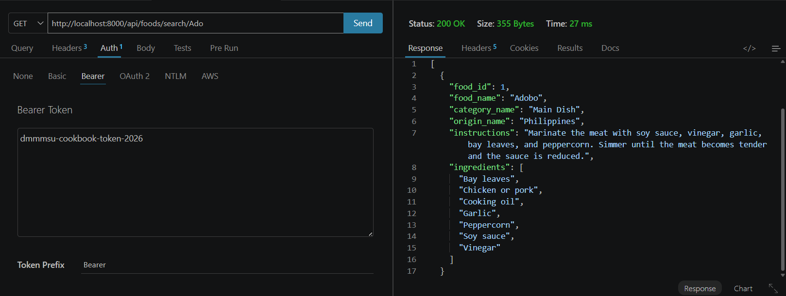
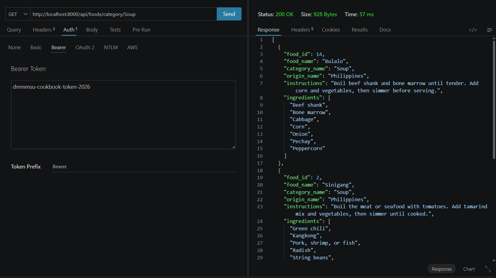
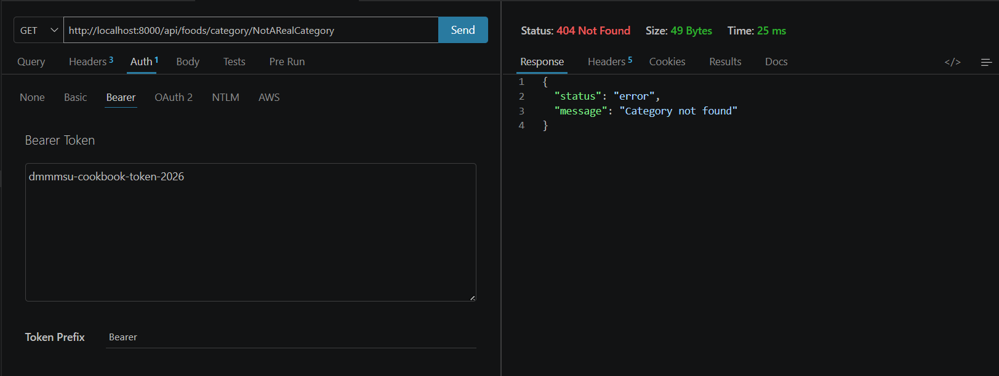
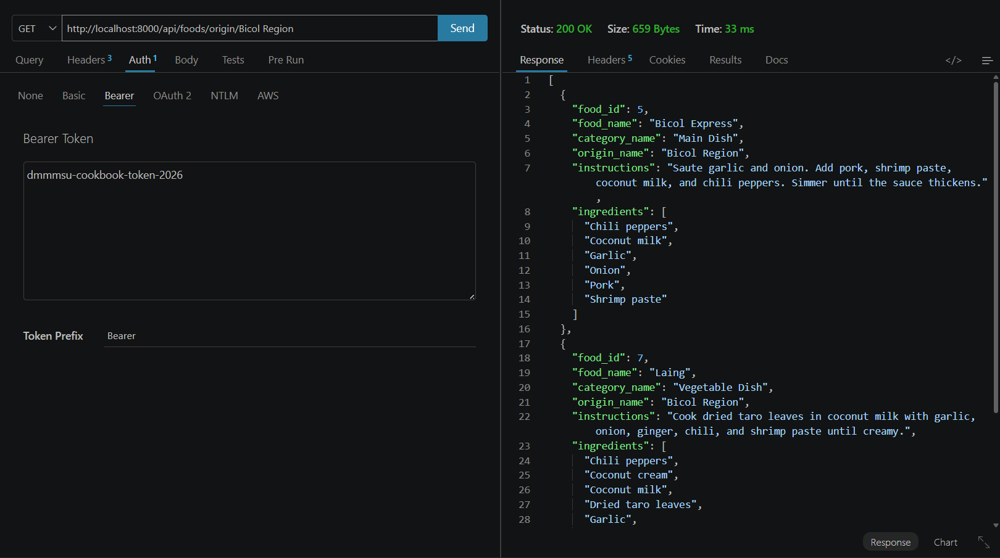
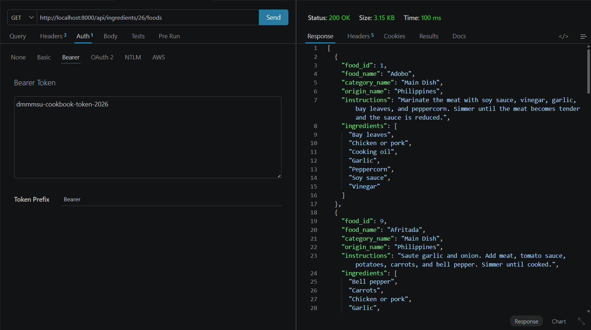
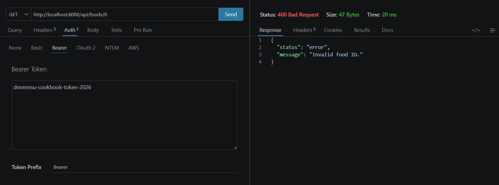
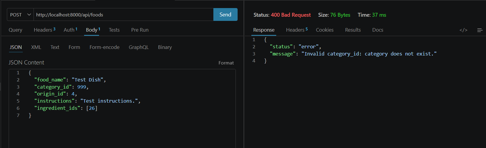
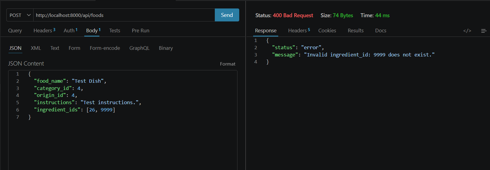
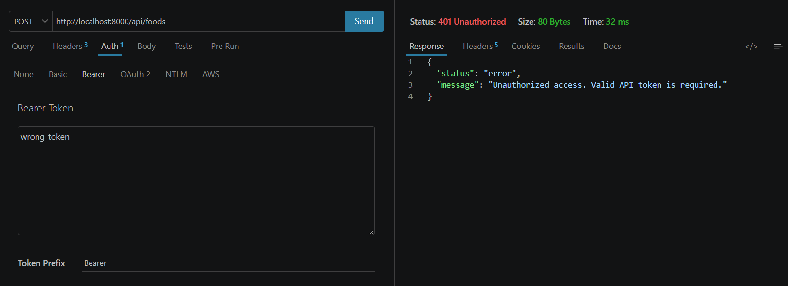
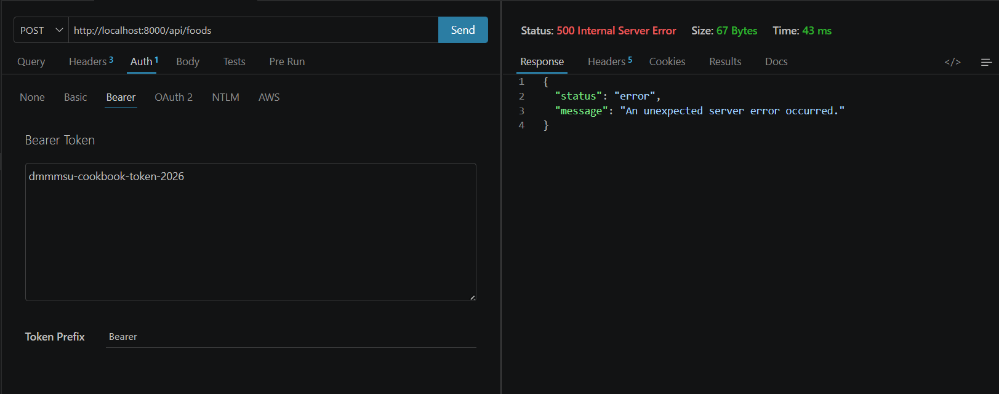

# Filipino Cookbook API

Slim Framework + PHP + MySQL API for Filipino dishes, with Bearer-token authentication.

**Full API documentation:** see [`API_DOCUMENTATION.md`](API_DOCUMENTATION.md).

## Configuration / Getting Started

1. Clone this repository and open it in your editor.
2. Install PHP dependencies from the project root:

```bash
composer install
```

3. Copy the example config file and edit the real values locally:

```bash
copy config.example.php config.php
```

*(On macOS/Linux: `cp config.example.php config.php`.)*

4. In `config.php`, set your MySQL host, database name, username, password, and `API_TOKEN`.  
   Do **not** commit `config.php` — it is listed in `.gitignore`. Only `config.example.php` (placeholders) belongs in the repo.
5. Import the SQL database (see **Database Setup** below).
6. Serve the project with XAMPP/Apache (or another PHP host) so `public/` is reachable in the browser.

## Base URL

Local XAMPP example (adjust the folder name if your project path differs):

```text
http://localhost/filipino-cookbook-api/public
```

Examples:

| Purpose | Full URL |
|---------|----------|
| Welcome (no token) | `http://localhost/filipino-cookbook-api/public/` |
| List foods (token required) | `http://localhost/filipino-cookbook-api/public/api/foods` |
| Search foods | `http://localhost/filipino-cookbook-api/public/api/foods/search/Ado` |

In Thunder Client / Postman, store this as `{{baseUrl}}` and call paths like `{{baseUrl}}/api/foods`.

## Authentication

- All routes under `/api/...` require a Bearer token.
- The public welcome route `GET /` does **not** require a token.
- Send the token in the `Authorization` header:

```http
Authorization: Bearer YOUR_API_TOKEN_HERE
```

- The expected token value is whatever you set as `API_TOKEN` in your local `config.php` (or the `API_TOKEN` environment variable).  
  Use the same value in Thunder Client/Postman. Do not publish real tokens in the README or commits.
- Missing or invalid token → `401` with:

```json
{
  "status": "error",
  "message": "Unauthorized access. Valid API token is required."
}
```

## Database Setup

- **Database name:** `filipino_cookbook_api`
- **SQL file:** `database/filipino_foods_relational.sql`

**Table relationships:** `categories` → `foods` ← `origins`, and `foods` → `food_ingredients` ← `ingredients` (many-to-many).

### Import with phpMyAdmin

1. Open phpMyAdmin (usually `http://localhost/phpmyadmin`).
2. Click **New** / **Databases** and create a database named exactly `filipino_cookbook_api` (collation `utf8mb4_general_ci` or similar is fine).
3. Select the `filipino_cookbook_api` database.
4. Open the **Import** tab.
5. Choose file `database/filipino_foods_relational.sql` from this project.
6. Click **Go** / **Import** and confirm the tables and sample data were created.

> Note: The SQL script also includes `CREATE DATABASE` / `USE filipino_cookbook_api`. If you already created the database in step 2, the import still works; the script will recreate/select it as written.

### Import with MySQL CLI

From the project root (adjust the MySQL user/password if needed):

```bash
mysql -u root -p < database/filipino_foods_relational.sql
```

Or, if you prefer creating the database first in the client, then importing while connected:

```bash
mysql -u root -p -e "CREATE DATABASE IF NOT EXISTS filipino_cookbook_api;"
mysql -u root -p filipino_cookbook_api < database/filipino_foods_relational.sql
```

---

## Optional API Enhancements

This section documents the optional GET endpoints and security improvements added on top of the base Filipino Cookbook API.

### 1. New Endpoints Added

All three endpoints require the same Bearer token as the rest of the `/api` group and return the same food object shape used by `GET /api/foods` and `GET /api/foods/{id}`:

| Field | Type | Description |
|-------|------|-------------|
| `food_id` | integer | Food primary key |
| `food_name` | string | Dish name |
| `category_name` | string | Joined category label |
| `origin_name` | string | Joined origin label |
| `instructions` | string | Cooking instructions |
| `ingredients` | string[] | Ingredient names for that food |

---

#### 1.1 `GET /api/foods/category/{name}`

**Description:** Returns all foods that belong to the given category name (exact match on `categories.category_name`), each with its ingredients list.

**Purpose:** The base API listed categories (`GET /api/categories`) and all foods, but had no way to filter foods by category. This endpoint fills that gap using the existing `foods` ↔ `categories` relationship.

**Route & headers:**

```http
GET /api/foods/category/Soup
Authorization: Bearer YOUR_API_TOKEN_HERE
```

**Example successful response (`200 OK`):**

```json
[
  {
    "food_id": 14,
    "food_name": "Bulalo",
    "category_name": "Soup",
    "origin_name": "Philippines",
    "instructions": "Boil beef shank and bone marrow until tender. Add corn and vegetables, then simmer before serving.",
    "ingredients": [
      "Beef shank",
      "Bone marrow",
      "Cabbage",
      "Corn",
      "Onion",
      "Pechay",
      "Peppercorn"
    ]
  },
  {
    "food_id": 2,
    "food_name": "Sinigang",
    "category_name": "Soup",
    "origin_name": "Philippines",
    "instructions": "Boil the meat or seafood with tomatoes. Add tamarind mix and vegetables, then simmer until cooked.",
    "ingredients": [
      "Green chili",
      "Kangkong",
      "Pork, shrimp, or fish",
      "Radish",
      "String beans",
      "Tamarind mix",
      "Tomato"
    ]
  },
  {
    "food_id": 4,
    "food_name": "Tinola",
    "category_name": "Soup",
    "origin_name": "Philippines",
    "instructions": "Saute garlic, onion, and ginger. Add chicken and fish sauce. Pour water and simmer, then add papaya and malunggay.",
    "ingredients": [
      "Chicken",
      "Fish sauce",
      "Garlic",
      "Ginger",
      "Green papaya",
      "Malunggay leaves",
      "Onion"
    ]
  }
]
```

**Example error response (`404 Not Found`):**

```json
{
  "status": "error",
  "message": "Category not found"
}
```

*(If the category exists but has no foods, the message is `"No foods found for this category"`.)*

| Status | When |
|--------|------|
| `200` | Category exists and has at least one food |
| `400` | Category name path segment is empty |
| `401` | Missing or invalid Bearer token |
| `404` | Category does not exist, or has no foods |
| `500` | Unexpected server/database error |

---

#### 1.2 `GET /api/foods/origin/{name}`

**Description:** Returns all foods whose origin matches the given origin name (exact match on `origins.origin_name`), each with its ingredients list.

**Purpose:** The schema includes an `origins` table (e.g. Bacolod, Bicol Region, Ilocos Region, Philippines), but the base API never exposed origin-based filtering. This endpoint makes regional dishes queryable.

**Route & headers:**

```http
GET /api/foods/origin/Bicol%20Region
Authorization: Bearer YOUR_API_TOKEN_HERE
```

**Example successful response (`200 OK`):**

```json
[
  {
    "food_id": 5,
    "food_name": "Bicol Express",
    "category_name": "Main Dish",
    "origin_name": "Bicol Region",
    "instructions": "Saute garlic and onion. Add pork, shrimp paste, coconut milk, and chili peppers. Simmer until the sauce thickens.",
    "ingredients": [
      "Chili peppers",
      "Coconut milk",
      "Garlic",
      "Onion",
      "Pork",
      "Shrimp paste"
    ]
  },
  {
    "food_id": 7,
    "food_name": "Laing",
    "category_name": "Vegetable Dish",
    "origin_name": "Bicol Region",
    "instructions": "Cook dried taro leaves in coconut milk with garlic, onion, ginger, chili, and shrimp paste until creamy.",
    "ingredients": [
      "Chili peppers",
      "Coconut cream",
      "Coconut milk",
      "Dried taro leaves",
      "Garlic",
      "Ginger",
      "Onion",
      "Shrimp paste"
    ]
  }
]
```

**Example error response (`404 Not Found`):**

```json
{
  "status": "error",
  "message": "Origin not found"
}
```

*(If the origin exists but has no foods, the message is `"No foods found for this origin"`.)*

| Status | When |
|--------|------|
| `200` | Origin exists and has at least one food |
| `400` | Origin name path segment is empty |
| `401` | Missing or invalid Bearer token |
| `404` | Origin does not exist, or has no foods |
| `500` | Unexpected server/database error |

---

#### 1.3 `GET /api/ingredients/{id}/foods`

**Description:** Returns all foods that use the ingredient identified by `{id}`, each with its full ingredients list.

**Purpose:** The base API listed ingredients and nested them under each food, but could not answer “which dishes use garlic?” This endpoint uses the `food_ingredients` junction table to support that lookup.

**Route & headers:**

```http
GET /api/ingredients/26/foods
Authorization: Bearer YOUR_API_TOKEN_HERE
```

*(Ingredient ID `26` is Garlic in the sample dataset.)*

**Example successful response (`200 OK`):**

```json
[
  {
    "food_id": 1,
    "food_name": "Adobo",
    "category_name": "Main Dish",
    "origin_name": "Philippines",
    "instructions": "Marinate the meat with soy sauce, vinegar, garlic, bay leaves, and peppercorn. Simmer until the meat becomes tender and the sauce is reduced.",
    "ingredients": [
      "Bay leaves",
      "Chicken or pork",
      "Cooking oil",
      "Garlic",
      "Peppercorn",
      "Soy sauce",
      "Vinegar"
    ]
  },
  {
    "food_id": 5,
    "food_name": "Bicol Express",
    "category_name": "Main Dish",
    "origin_name": "Bicol Region",
    "instructions": "Saute garlic and onion. Add pork, shrimp paste, coconut milk, and chili peppers. Simmer until the sauce thickens.",
    "ingredients": [
      "Chili peppers",
      "Coconut milk",
      "Garlic",
      "Onion",
      "Pork",
      "Shrimp paste"
    ]
  }
]
```

**Example error response (`404 Not Found`):**

```json
{
  "status": "error",
  "message": "Ingredient not found"
}
```

*(If the ingredient exists but is unused, the message is `"No foods found for this ingredient"`.)*

| Status | When |
|--------|------|
| `200` | Ingredient exists and is used by at least one food |
| `400` | Ingredient ID is missing or not a positive integer |
| `401` | Missing or invalid Bearer token |
| `404` | Ingredient does not exist, or has no linked foods |
| `500` | Unexpected server/database error |

---

### 2. Security Enhancements Implemented

#### 2.1 Input validation & sanitization on `POST` / `PUT` `/api/foods`

**Description:** Write requests now run through `validateFoodPayload()` before any insert/update. The helper:

- Trims `food_name` and `instructions`
- Rejects empty or too-short `food_name` (minimum 2 characters)
- Requires non-empty `instructions`
- Requires `category_id` and `origin_id` to be valid integers **and** to exist in `categories` / `origins`
- Requires every `ingredient_id` to be a valid integer **and** to exist in `ingredients` (invalid IDs are named in the error message)

**Purpose:** The original handlers only checked that required fields were present. Invalid foreign keys or bad types could reach MySQL and surface raw PDO/SQL errors. This closes that gap with clear `400` responses before the write runs.

**Example rejected request — invalid `category_id`:**

```http
POST /api/foods
Authorization: Bearer YOUR_API_TOKEN_HERE
Content-Type: application/json
```

```json
{
  "food_name": "Test Dish",
  "category_id": 999,
  "origin_id": 4,
  "instructions": "Test instructions.",
  "ingredient_ids": [26]
}
```

**Response (`400 Bad Request`):**

```json
{
  "status": "error",
  "message": "Invalid category_id: category does not exist."
}
```

**Example rejected request — invalid `ingredient_id`:**

```http
POST /api/foods
Authorization: Bearer YOUR_API_TOKEN_HERE
Content-Type: application/json
```

```json
{
  "food_name": "Test Dish",
  "category_id": 4,
  "origin_id": 4,
  "instructions": "Test instructions.",
  "ingredient_ids": [26, 9999]
}
```

**Response (`400 Bad Request`):**

```json
{
  "status": "error",
  "message": "Invalid ingredient_id: 9999 does not exist."
}
```

---

#### 2.2 Secure error handling

**Description:**

- `addErrorMiddleware` debug flags are gated behind the `APP_DEBUG` environment variable (`1`, `true`, or `yes`). When unset, details default to **off**.
- Shared helper `serverErrorResponse()` returns a generic JSON error.
- Every `/api` route wraps database work in `try/catch (Throwable)` so unexpected failures never leak SQL, stack traces, or file paths.

**Purpose:** The original setup used `addErrorMiddleware(true, true, true)`, which could expose internal exception details to clients. Hiding those details reduces information disclosure while still returning a consistent JSON error shape.

**Example generic failure response (`500 Internal Server Error`):**

```json
{
  "status": "error",
  "message": "An unexpected server error occurred."
}
```

*(To reproduce for a screenshot: temporarily stop MySQL / point the DB name at a non-existent database, then call any `/api` endpoint with a valid token. Restore the correct DB settings afterward.)*

---

### 3. Files Modified

All enhancement changes were made in **`public/index.php` only**. No other project files were modified for these features.

What changed inside that file:

| Change | Summary |
|--------|---------|
| Route order | Registered `/foods/search/{name}`, `/foods/category/{name}`, and `/foods/origin/{name}` **before** `/foods/{id}` so `{id}` no longer swallows those paths |
| 3 new route handlers | Category filter, origin filter, and foods-by-ingredient |
| `attachIngredients()` | Shared helper that attaches the `ingredients` string array to food rows |
| `validateFoodPayload()` | Shared sanitization + FK validation for `POST` / `PUT` `/api/foods` |
| `serverErrorResponse()` | Shared generic `500` JSON response helper |
| `addErrorMiddleware` gating | Debug/detail flags enabled only when `APP_DEBUG` is set |
| `try/catch` wrapping | All `/api` route handlers catch unexpected errors and return the generic `500` body |

---

### 4. Testing Instructions

Use **Thunder Client** (VS Code/Cursor) or **Postman**. Set `{{baseUrl}}` to the value in **Base URL** above (default example: `http://localhost/filipino-cookbook-api/public`).

**Token header (required for every `/api` request):**

| Header | Value |
|--------|--------|
| `Authorization` | `Bearer YOUR_API_TOKEN_HERE` |

*(Replace `YOUR_API_TOKEN_HERE` with the `API_TOKEN` from your local `config.php`.)*

**Steps for another student:**

1. Import or create a new request collection named “Filipino Cookbook API — Enhancements”.
2. Set the collection (or request) header: `Authorization: Bearer YOUR_API_TOKEN_HERE` (same value as in `config.php`).
3. Confirm MySQL is running and the `filipino_cookbook_api` database is imported.
4. Test the **search route fix** (must not be treated as `{id}`):
   - `GET {{baseUrl}}/api/foods/search/Ado` → expect Adobo (and similar) with `200`.
5. Test **foods by category**:
   - `GET {{baseUrl}}/api/foods/category/Soup` → expect Soup dishes with `200`.
   - `GET {{baseUrl}}/api/foods/category/NotARealCategory` → expect `404` with `"Category not found"`.
6. Test **foods by origin**:
   - `GET {{baseUrl}}/api/foods/origin/Bicol Region` (encode space as `%20` if needed) → expect Bicol Express and Laing with `200`.
7. Test **foods by ingredient**:
   - `GET {{baseUrl}}/api/ingredients/26/foods` → expect dishes containing Garlic with `200`.
   - `GET {{baseUrl}}/api/ingredients/99999/foods` → expect `404` with `"Ingredient not found"`.
8. Test **invalid food ID**:
   - `GET {{baseUrl}}/api/foods/0` or `GET {{baseUrl}}/api/foods/-1` → expect `400` `"Invalid food ID."`.
9. Test **POST validation**:
   - `POST {{baseUrl}}/api/foods` with body using `category_id: 999` → expect `400` naming invalid `category_id`.
   - `POST {{baseUrl}}/api/foods` with `ingredient_ids: [9999]` (and otherwise valid fields) → expect `400` naming invalid `ingredient_id`.
10. Test **auth failure**:
    - Same GET as step 5, but remove the `Authorization` header or use a wrong token → expect `401`.
11. (Optional) Test **generic 500**:
    - Temporarily break the DB connection settings, call any `/api` endpoint with a valid token → expect `500` with the generic message only (no SQL/stack). Restore settings when done.

---

### 5. Screenshots of Successful Testing

Capture and paste screenshots below after you run the tests in Thunder Client or Postman.

**Screenshot 1: GET /api/foods/search/Ado — successful search result**  


**Screenshot 2: GET /api/foods/category/Soup — foods by category**  


**Screenshot 3: GET /api/foods/category/NotARealCategory — 404 category not found**  


**Screenshot 4: GET /api/foods/origin/Bicol Region — foods by origin**  


**Screenshot 5: GET /api/ingredients/26/foods — foods by ingredient (Garlic)**  


**Screenshot 6: GET /api/ingredients/99999/foods — 404 ingredient not found**  


**Screenshot 7: GET /api/foods/0 — 400 invalid food ID**  


**Screenshot 8: POST /api/foods with bad category_id — 400 validation**  


**Screenshot 9: POST /api/foods with bad ingredient_id — 400 validation**  


**Screenshot 10: Missing or invalid Bearer token — 401 Unauthorized**  


**Screenshot 11: Generic 500 error — no SQL/stack details exposed**  

